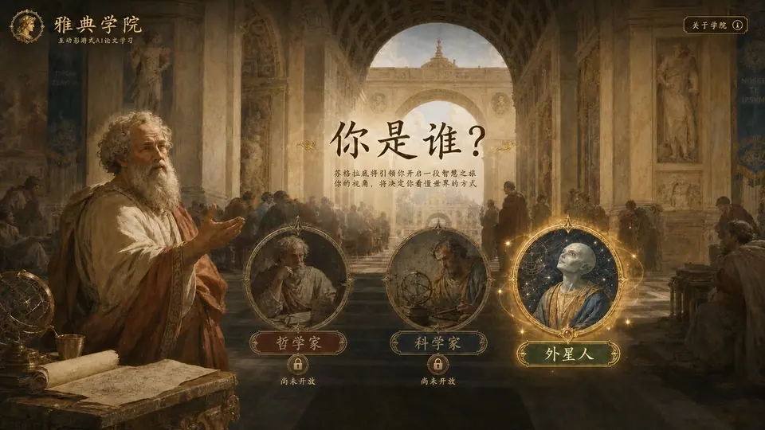

<div align="center">

# 雅典学院 · Athens Academy

### 把 AI 论文，变成一场可以走进去的思想实验

*An interactive visual-novel experience that turns landmark AI papers into explorable Renaissance manuscripts.*

[](https://yqy1018.github.io/athens-academy/)
[](https://github.com/yqy1018/athens-academy/stargazers)

<a href="https://yqy1018.github.io/athens-academy/">
  
</a>

**[▶ 立即进入雅典学院](https://yqy1018.github.io/athens-academy/)**

</div>

## 这不是一座论文仓库

论文告诉你结论，雅典学院邀请你亲手发现结论。

在这里，抽象机制会被翻译成可以观察和操作的文艺复兴手稿：Attention 化作词语之间强弱不同的光线，Q、K、V 化作羽毛笔、铜钥匙与卷轴，Transformer 则成为一座被逐层点亮的机械钟楼。

目标只有一个：**让第一次接触 AI 论文的人，也能真正理解它为什么成立。**

## 现在可以体验

| 章节 | 你会亲手看到什么 | 理解什么 |
| --- | --- | --- |
| 旧路的长廊 | 信息沿词语逐步传递 | 旧模型为什么走得慢 |
| 整句话一起亮起 | 不同强度的光线同时连接上下文 | Attention 在看什么 |
| Q、K、V 三件仪器 | 为 It 寻找匹配对象并取回信息 | Query、Key、Value 如何协作 |
| Transformer 钟楼 | 多头目光、位置刻度与遮光帘逐层启动 | 一套完整架构如何成立 |

## 我们坚持的设计原则

- **交互不是装饰。** 每一次点击、光线与停顿，都对应论文中的因果关系。
- **先理解，再术语。** 先让你看到机制发生，再告诉你它叫什么。
- **知识也值得拥有世界观。** 文艺复兴学院、羊皮纸、铜版画与天球仪，共同构成一座可探索的思想空间。

## 本地运行

这是一个无需构建工具的单页体验：

```bash
git clone https://github.com/yqy1018/athens-academy.git
cd athens-academy
python3 -m http.server 8000
```

然后打开 [http://localhost:8000](http://localhost:8000)。

## 接下来

- [x] 用互动方式讲清 Transformer / Attention
- [x] 建立统一的文艺复兴知识学院视觉系统
- [ ] 扩展更多改变 AI 历史的论文路线
- [ ] 增加更多身份视角与苏格拉底式追问
- [ ] 让学习者留下自己的知识手稿

---

<div align="center">

如果你也相信，AI 论文不该只属于少数人——<br />
**欢迎点亮一颗 ⭐，一起把重要思想做成可以走进去的世界。**

</div>
